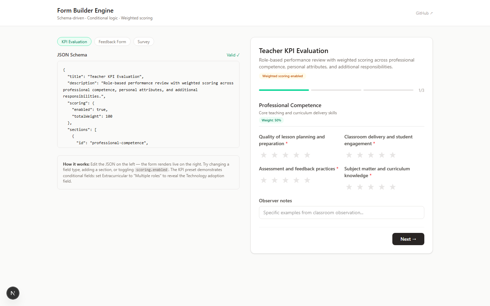
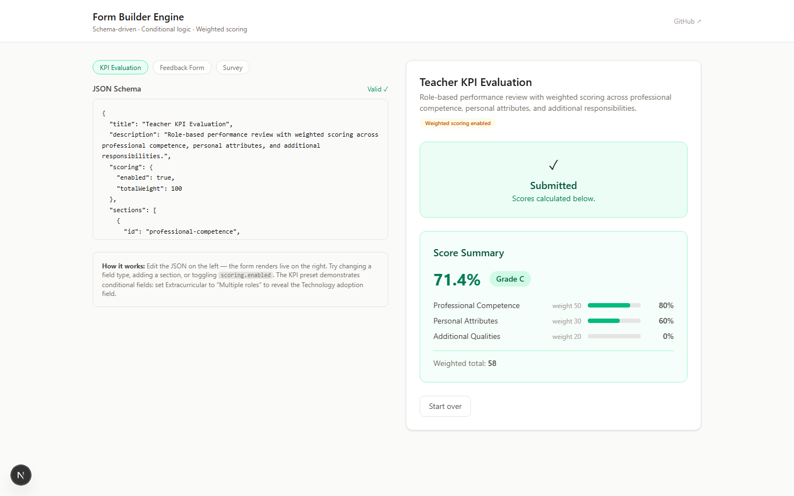
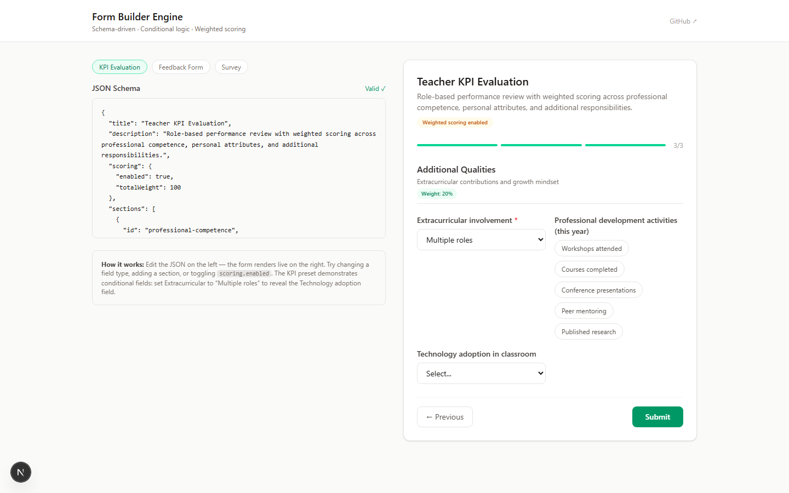
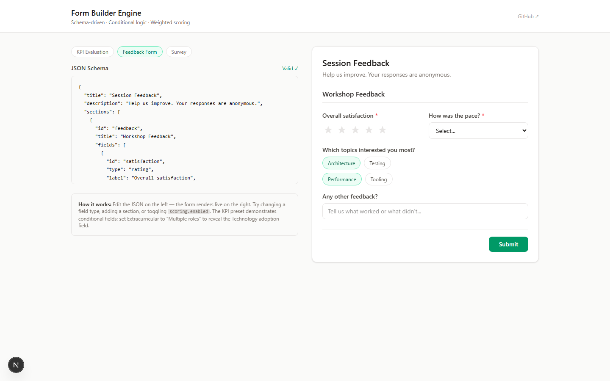
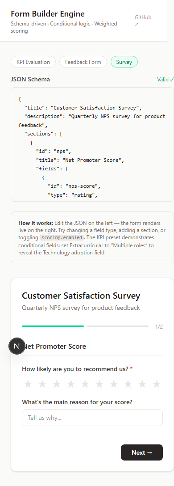
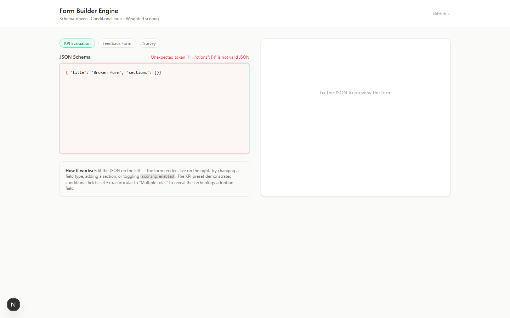

# Form Builder Engine

Schema-driven form builder. Paste a JSON config and get a fully functional multi-section form with conditional logic, validation, and weighted scoring.

Built to demonstrate the engine behind the KPI evaluation system used at a Cambridge school — the same component architecture that handles 604 reviews across ~300 teachers.

## What you can build

**KPI evaluations** — multi-section, weighted scoring, conditional fields:



**Weighted scoring with per-section breakdown** — grades and bar charts calculated automatically:



**Conditional fields** — fields that appear only when a condition is met (here, "Technology adoption" reveals when Extracurricular is set to "Multiple roles"):



**Feedback forms** — single-section, lightweight, with multi-select chips:



**Customer surveys** — NPS ratings, multi-select features, all mobile-responsive:



**Live JSON editing** — edit the schema on the left, form updates instantly. Validation errors highlighted inline:



## What this proves

| Capability | Implementation |
|---|---|
| **Schema-driven rendering** | JSON config → fully functional form. Zero hardcoded inputs |
| **Conditional logic** | Fields appear/disappear based on other field values |
| **Weighted scoring** | Multi-section forms with configurable weights, per-section breakdown, grade calculation |
| **7 field types** | Text, number, select, multi-select, date, file upload, star rating |
| **Multi-step navigation** | Progress bar, section-by-section with validation gates |
| **Mobile responsive** | Single-column on mobile, 2-column grid on desktop |
| **Accessibility** | ARIA labels, keyboard navigation, screen-reader friendly |
| **Real-world patterns** | Submission state, error recovery, reset, unsaved-change handling |
| **E2E tested** | 16 Playwright tests covering rendering, conditionals, scoring, mobile — all passing |

## Run locally

```bash
npm install
npm run dev           # http://localhost:7200
npm test              # Playwright E2E tests (16 tests, Chromium + mobile)
npm run test:ui       # Interactive test runner
```

## Architecture

```
JSON Schema (editable on left)
        │
        ▼
FormRenderer — manages state, section navigation, validation, submission
        │
        ├── FormSection — renders one section at a time
        │       │
        │       ├── TextField
        │       ├── NumberField
        │       ├── SelectField / MultiSelectField
        │       ├── DateField
        │       ├── FileUploadField
        │       └── RatingField (star rating)
        │
        └── ScoreSummary — weighted scoring breakdown (post-submit)
```

## The schema

```json
{
  "title": "Teacher KPI Evaluation",
  "description": "Role-based performance review with weighted scoring",
  "scoring": { "enabled": true, "totalWeight": 100 },
  "sections": [
    {
      "id": "competence",
      "title": "Professional Competence",
      "description": "Core teaching and curriculum delivery skills",
      "weight": 50,
      "fields": [
        {
          "id": "lesson-planning",
          "type": "rating",
          "label": "Quality of lesson planning",
          "required": true,
          "maxRating": 5
        }
      ]
    }
  ]
}
```

## Design decisions

See [DECISIONS.md](./DECISIONS.md) for the architecture decision log (7 key decisions with trade-offs analyzed).
